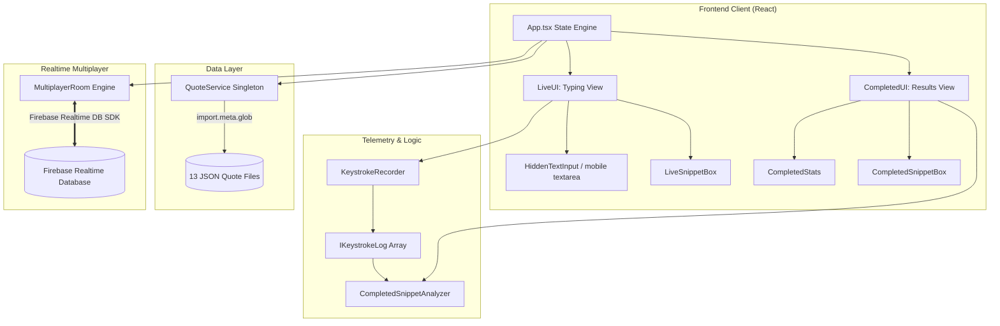

# 🎹 Keyflow

👉 **Live Demo:** [https://gopu07.github.io/keyflow](https://gopu07.github.io/keyflow)

<p align="center">
  
  
  
  
  
  
</p>

<p align="center">
  
</p>

---

## Overview

**Keyflow** is a distraction-free typing test built to analyze typing mechanics. Beyond tracking words per minute (WPM), it captures raw keystroke timing to map error patterns, measure typing consistency, and track character-level accuracy. It includes real-time multiplayer lobbies and local ghost caret playback for retrying snippets.

---

## Features

*   **Four Single-Player Modes**:
    *   *Quotes*: Dynamically pulls passages from 13 categories (programming, philosophy, startups, etc.) using split, lazy-loaded JSON bundles.
    *   *Time*: Fixed-duration tests (15s, 30s, or 60s).
    *   *Words*: Random selections from a pool of common words (25, 50, or 100).
    *   *Custom*: Input your own text to practice.
*   **Real-time Multiplayer**:
    *   Instant lobby generation with 6-character room codes.
    *   Real-time progress, accuracy, and speed sync for all racers.
    *   Latency (ping) checked every 5 seconds per player.
*   **Ghost Caret Playback**:
    *   Records chronologically ordered keystrokes.
    *   Renders a secondary "ghost caret" representing your previous best run when retrying the same passage.
*   **Typing Telemetry**:
    *   *Error Heatmap*: Identifies keystroke accuracy using color-coded letters (clean, mistyped once, or repeatedly missed).
    *   *Consistency*: Speed variance tracking across word chunks to classify rhythm stability (Consistent, Moderate, Erratic).
    *   *Error Classification*: Differentiates between corrected errors (backspaced and fixed) and uncorrected errors (left in the final text).
    *   *Mistyped Registry*: Ranks your most common character substitutions.

---

## Getting Started

### 1. Prerequisites
Ensure you have **Node.js** (v18+) and **npm** installed.

### 2. Installation
```bash
# Clone the repository
git clone https://github.com/gopu07/keyflow.git
cd keyflow

# Install dependencies
npm install
```

### 3. Running Locally
```bash
# Start development server
npm run dev

# Run unit tests
npm run test

# Check code formatting
npx prettier --check "src/**/*.{ts,tsx}"

# Run quotes dataset validation
python scripts/verify_dataset.py
```

### 4. Build and Production Preview
```bash
# Compile optimized bundle
npm run build

# Preview production build locally
npm run preview
```

### 5. Running with Docker
```bash
# Build the Docker image
docker build -t keyflow-app .

# Run the container
docker run -p 8080:80 keyflow-app
```
Alternatively, launch using **Docker Compose**:
```bash
docker-compose up --build
```
Once running, navigate to `http://localhost:8080`.

---

## Architecture

Keyflow operates as a client-driven serverless web app, synchronizing multiplayer rooms directly through Firebase Realtime Database SDK client triggers.



### Technical Implementations

*   **Distributed State and Synchronization**: Multiplayer lobbies require no dedicated server backend. Clients coordinate room state by executing atomic transactions (`runTransaction`) directly on Firebase Realtime Database paths.
*   **Time Synchronization**: To prevent inaccuracies from client clock drift, clients listen to Firebase's virtual offset path `.info/serverTimeOffset`. This is added to local clocks to sync elapsed racing times accurately across users.
*   **Host Migration**: If a lobby host disconnects, the remaining clients detect the dropout via Firebase presence nodes, sort all active player IDs lexicographically, and assign host duties to the player with the lowest ID.
*   **Dynamic Quote Bundles**: Passages are lazy-loaded on-demand using Vite's `import.meta.glob` to avoid bloating the initial JS bundle.

---

## Folder Structure

```
keyflow/
├── .github/                   # GitHub templates & workflows
│   ├── ISSUE_TEMPLATE/
│   └── pull_request_template.md
├── data/                      # Fallback data & assets
│   └── keyflow_demo.gif
├── public/                    # Static browser assets
├── scripts/                   # Validation scripts
│   └── verify_dataset.py      # Quotes schema & validation script
├── src/                       # Source code
│   ├── components/            # UI components
│   │   ├── CompletedSnippetBox.tsx
│   │   ├── CompletedStats.tsx
│   │   ├── CompletedUI.tsx
│   │   ├── HiddenTextInput.tsx
│   │   ├── HostWaitingModal.tsx
│   │   ├── LiveSnippetBox.tsx
│   │   ├── LiveUI.tsx
│   │   ├── MultiplayerFooter.tsx
│   │   ├── ProgressIndicator.tsx
│   │   └── Toast.tsx
│   ├── data/                  # Raw JSON wordlists and quotes
│   │   ├── quotes/            # 13 JSON quote category libraries
│   │   └── words.json         # 1000 common words list
│   ├── lib/                   # Telemetry & Firebase helpers
│   │   ├── CompletedSnippetAnalyzer.tsx
│   │   ├── KeystrokeRecorder.tsx
│   │   ├── LiveSnippetAnalyzer.tsx
│   │   ├── MultiplayerRoom.ts
│   │   ├── QuoteService.ts
│   │   └── SnippetGenerator.tsx
│   ├── firebase.ts            # Firebase initialization
│   └── index.tsx              # React mounting entrypoint
├── test/                      # Jest test suites
│   ├── CompletedSnippetAnalyzer.test.ts
│   ├── QuoteService.test.ts
│   ├── SnippetGenerator.test.ts
│   ├── basic.test.ts
│   └── stringUtils.test.ts
├── vite.config.ts             # Vite configuration
└── package.json               # Package scripts & dependencies
```

---

## Tech Stack

| Layer | Technology | Purpose |
| --- | --- | --- |
| **Frontend Core** | React v16.13.1 | UI library & state management |
| **Language** | TypeScript v6.0.3 | Strict type contracts and telemetry types |
| **Realtime Backend** | Firebase v12.15.0 | Shared multiplayer synchronization database |
| **Build & Bundler** | Vite v5.1.4 | Hot-reload development server & rollup compiler |
| **Styling** | Vanilla CSS | Tailored dark-themed styling and responsive grids |
| **Utilities** | Lodash v4.17.21 | Object grouping & map helpers |
| **Testing** | Jest + `ts-jest` | Automated test suite verifying logic, schemas, and generators |

---

## Environment Variables

Multiplayer features require a `.env` file at the root folder containing the following Firebase credentials:

| Variable Name | Required | Description |
| --- | --- | --- |
| `VITE_FIREBASE_API_KEY` | Yes (for MP) | Firebase API Key. |
| `VITE_FIREBASE_AUTH_DOMAIN` | Yes (for MP) | Firebase Auth Domain. |
| `VITE_FIREBASE_PROJECT_ID` | Yes (for MP) | Firebase Project ID. |
| `VITE_FIREBASE_STORAGE_BUCKET`| No | Firebase Storage bucket. |
| `VITE_FIREBASE_MESSAGING_SENDER_ID`| No | Firebase Messaging Sender ID. |
| `VITE_FIREBASE_APP_ID` | Yes (for MP) | Firebase App ID. |
| `VITE_FIREBASE_DATABASE_URL` | Yes (for MP) | Firebase Realtime Database URL. |

---

## Database & Schema

### Realtime Database Schema

```json
{
  "rooms": {
    "ROOM_CODE": {
      "snippetText": "...",
      "snippetAuthor": "...",
      "hostId": "usr_abc123",
      "status": "waiting | countdown | running | finished",
      "countdown": 3,
      "elapsedSeconds": 15,
      "winnerId": "usr_xyz789",
      "winnerName": "Alice",
      "createdAt": 1718042948291,
      "raceStartTimestamp": 1718042953291,
      "rankings": ["usr_xyz789", "usr_abc123"],
      "config": {
        "mode": "quote",
        "timeOption": 30,
        "wordsOption": 50,
        "quoteCategory": "motivation"
      },
      "players": {
        "usr_abc123": {
          "id": "usr_abc123",
          "displayName": "Bob",
          "progress": 72.5,
          "wpm": 68,
          "accuracy": 96,
          "finished": false,
          "ready": true,
          "ping": 42,
          "leftRace": false,
          "errors": 4
        }
      }
    }
  }
}
```

### Stale Room Garbage Collection
To prevent stale room data piling up in the database, `MultiplayerRoom.cleanupStaleRooms` is invoked whenever a new host initializes a room. It queries rooms ordered by `createdAt` and deletes rooms older than 1 hour.

---

## Security & Performance

1. **Vite Environment Encapsulation**: Firebase keys are compiled at build time using the `VITE_` prefix and never hardcoded in source control.
2. **Strict Content Security Policy (CSP)**: `index.html` restricts browser script sources and connection domains to local domains and Firebase database endpoints (`wss://*.firebasedatabase.app`).
3. **O(log N) Caret Playback**: Rendering the ghost caret at 60fps requires matching elapsed milliseconds to cursor indices. Keyflow logs keypress events in a sorted timeline and resolves positions using **Binary Search** (`LiveUI.tsx:433-446`) to ensure O(log N) computation per frame.
4. **Input Sanitization**: Multiplayer names are limited to 15 characters, and inputs utilize standard React controlled properties to prevent injection attacks.

---

## Testing

Run the test suite using:
```bash
npm run test
```

*   **`CompletedSnippetAnalyzer.test.ts`**: Verifies consistency index math, accuracy percentages, heatmap color codes, and error classification calculations.
*   **`QuoteService.test.ts`**: Verifies dynamic quotes loading and index category mappings.
*   **`SnippetGenerator.test.ts`**: Audits character sanity checks to ensure fallback quotes contain no illegal symbols.
*   **`stringUtils.test.ts`**: Asserts text cleaning, punctuation removal, and lowercasing helper routines.

---

## Future Improvements

1. **Interactive Charts**: Integrate charting library (e.g. `Recharts`) to plot historical WPM and accuracy metrics over time.
2. **Database Persistence**: Add user authentication to persist stats and track personal progress milestones.
3. **Keyboard Sound Packs**: Mechanical switch audio options (Blues, Browns, Linears) to enhance feedback.

---

## License

Keyflow is licensed under the MIT License. See [LICENSE](LICENSE) for details.

---

## Contributing

Contributions are welcome. Please read the [Contributing Guidelines](CONTRIBUTING.md) and the [Code of Conduct](CODE_OF_CONDUCT.md) before submitting pull requests.
