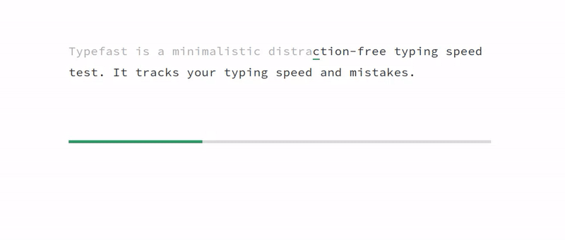

# 🎹 Keyflow

<p align="center">
  <strong>A modern, minimalistic, and high-performance typing test application featuring real-time multiplayer racing, ghost-caret playback, and deep character-level analytics.</strong>
</p>

<p align="center">
  
  
  
  
  
  
</p>

<p align="center">
  
</p>

---

## 📖 Overview

**Keyflow** is a feature-rich, distraction-free typing speed test built for developers, typists, and competitive gamers. While typical typing websites focus solely on simple WPM calculations, Keyflow provides deep keystroke telemetry and interactive feedback:

1. **Why it exists**: Typing speed is a primary bottleneck for software engineers and knowledge workers. To improve, developers need granular analysis of their friction points—not just a single WPM number.
2. **The problem it solves**: Keyflow records exact typing events (down to the millisecond) to build an **Error Heatmap**, differentiate between **Corrected** and **Uncorrected** errors, measure **Consistency scores**, and pinpoint **Most Mistyped Characters** (e.g., typing 'd' instead of 's').
3. **Competitive Edge**: Users can spawn instant **Multiplayer Rooms** powered by Firebase Realtime Database to race against friends, or enable **Ghost Caret Playback** to race live against their own previous best attempts on the same snippet.

---

## ✨ Features

- **🎮 Four Single-Player Modes**:
  - **Quote Mode**: Dynamically pull paragraphs from 13 different curated categories (books, gaming, philosophy, programming, startups, space, movies, etc.) using lazy-loaded JSON bundles.
  - **Time Mode**: Test speed under fixed-duration conditions (15s, 30s, or 60s).
  - **Words Mode**: Practice typing random sets of high-frequency words (25, 50, or 100).
  - **Custom Mode**: Paste custom articles, code blocks, or copy-paste text to practice.
- **🏁 Real-time Multiplayer Races**:
  - Instantly create race lobbies and share 6-character room codes.
  - Live progress synchronization shows other players' positions, WPM, and accuracy in real-time.
  - Auto-heals if the host leaves by implementing a decentralized **Host Migration Algorithm**.
  - Dynamic ping metrics updated every 5 seconds per player.
- **👻 Ghost Caret Playback**:
  - Records your exact keypress-by-keypress history.
  - During retries, a secondary "ghost caret" races beside you in real-time to challenge your previous attempt.
- **📊 Granular Typing Telemetry**:
  - **Error Heatmap**: Color-coded letters highlighting characters typed cleanly (green), mistyped once (amber), or struggled with repeatedly (red with bottom border).
  - **Consistency Score**: Calculates the Coefficient of Variation (CV) of rolling typing speeds across word segments to rank typing stability (Consistent, Moderate, Erratic).
  - **Corrected vs. Uncorrected Errors**: Measures how many errors were backspaced and resolved vs. left broken in the final text.
  - **Mistyped Registry**: Ranks exactly which characters you substitute most frequently.

---

## 🛠️ Tech Stack

| Layer | Technology | Purpose |
| --- | --- | --- |
| **Frontend Core** | React v16.13.1 | Modular user interface & class-based reactive rendering. |
| **Language** | TypeScript v6.0.3 | Robust type contracts, type-safe telemetry logging, and interfaces. |
| **Realtime Backend** | Firebase v12.15.0 | Shared multiplayer synchronization, database triggers, and state. |
| **Build & Bundler** | Vite v5.1.4 | Lightning-fast development server and optimized code-split production builds. |
| **Styling** | Vanilla CSS | Tailored dark-themed styling, smooth transitions, and responsive grid layouts. |
| **Utilities** | Lodash v4.17.21 | Operations for array chunking, list groupings, and mapping. |
| **Testing** | Jest + `ts-jest` | Automated test suite verifying analyzer, quote providers, and generators. |
| **DevOps & Containerization** | `gh-pages`, Docker, GitHub Actions | Scripted deployment pipelines, image containerization, and automated integration workflows. |

---

## 📐 Architecture

Keyflow operates as a decentralized, client-driven serverless web app:

```mermaid
graph TD
    subgraph Frontend Client (React)
        App[App.tsx State Engine] --> LiveUI[LiveUI: Typing View]
        App --> CompletedUI[CompletedUI: Results View]
        LiveUI --> HiddenTextInput[HiddenTextInput / mobile textarea]
        LiveUI --> LiveSnippetBox[LiveSnippetBox]
        CompletedUI --> CompletedStats[CompletedStats]
        CompletedUI --> CompletedSnippetBox[CompletedSnippetBox]
    end

    subgraph Telemetry & Logic
        LiveUI --> KeystrokeRecorder[KeystrokeRecorder]
        KeystrokeRecorder --> IKeystrokeLog[IKeystrokeLog Array]
        CompletedUI --> CompletedSnippetAnalyzer[CompletedSnippetAnalyzer]
        IKeystrokeLog --> CompletedSnippetAnalyzer
    end

    subgraph Data Layer
        QuoteService[QuoteService Singleton] -->|import.meta.glob| QuotesDB[(13 JSON Quote Files)]
        App --> QuoteService
    end

    subgraph Realtime Multiplayer
        App --> MultiplayerRoom[MultiplayerRoom Engine]
        MultiplayerRoom <==>|Firebase Realtime DB SDK| FirebaseDB[(Firebase Realtime Database)]
    end
```

### Key Architectural Patterns
1. **Keystroke Telemetry Pipeline**: The `KeystrokeRecorder` intercepts keydown events, wrapping characters and millisecond timestamps into an array of `IKeystrokeLog` structures. On completion, this array is processed by the `CompletedSnippetAnalyzer` to extract error frequencies, consistency metrics, and WPM speeds.
2. **Serverless Realtime Sync**: Instead of utilizing a dedicated Node.js server, clients manage multiplayer rooms directly through Firebase Realtime Database rules and atomic transactions (`runTransaction`).
3. **Dynamic Import Splitting**: Quotes are lazy-loaded on-demand using Vite's `import.meta.glob`. When a user selects the "philosophy" category, only `philosophy.json` is loaded over the network.

---

## 📂 Folder Structure

```
typefast-main/
├── .github/                   # GitHub Community and Issue Templates
│   ├── ISSUE_TEMPLATE/        # Issue Templates (bug reports & feature requests)
│   └── pull_request_template.md # PR check list
├── data/                      # Demo media & fallback datasets
│   ├── keyflow_demo.gif       # README demo GIF
│   └── words.json             # 1000 high-frequency word dictionary
├── public/                    # Static browser assets (favicon, manifest)
├── src/                       # Main TypeScript React application source
│   ├── components/            # Reusable UI elements
│   │   ├── CompletedSnippetBox.tsx # Visual text review on completion
│   │   ├── CompletedStats.tsx # Results dashboard (WPM, Acc, Errors)
│   │   ├── CompletedUI.tsx    # Overall test metrics layout
│   │   ├── HiddenTextInput.tsx # Captures desktop keyboard events
│   │   ├── HostWaitingModal.tsx # Lobby waiting modal
│   │   ├── LiveSnippetBox.tsx # Live text renderer highlighting cursor
│   │   ├── LiveUI.tsx         # Active single/multiplayer test UI
│   │   ├── MultiplayerFooter.tsx # Multiplayer leaderboard footer
│   │   ├── ProgressIndicator.tsx # Visual completion progress bar
│   │   └── Toast.tsx          # Real-time network alert notifications
│   ├── data/                  # Curated quote JSON datasets
│   │   └── quotes/            # 13 categories (books, philosophy, space...)
│   ├── lib/                   # Logical services and analysis helpers
│   │   ├── CompletedSnippetAnalyzer.tsx # Calculations for heatmaps, speed & consistency
│   │   ├── KeystrokeRecorder.tsx # Event handler for key down inputs
│   │   ├── LiveSnippetAnalyzer.tsx # Live cursor & completeness analytics
│   │   ├── MultiplayerRoom.ts  # Firebase database room sync wrapper
│   │   ├── QuoteService.ts    # Dynamic lazy loading JSON manager (Singleton)
│   │   └── SnippetGenerator.tsx # Fallback hardcoded quotes generator
│   ├── firebase.ts            # Firebase app initialization & server offset calculations
│   └── index.tsx              # React mounting entry point
├── test/                      # Jest unit test suites
│   ├── completed_snippet_analyzer.test.ts
│   ├── quote_service.test.ts
│   └── snippet_generator.test.ts
├── verify_dataset.py          # Python automation script auditing quote datasets
├── vite.config.ts             # Vite bundler configurations
└── package.json               # Package scripts, metadata & dependencies
```

---

## ⚙️ Environment Variables

To run multiplayer features locally, create a `.env` file in the project root containing your Firebase Realtime Database parameters:

| Variable Name | Required | Default Value | Description |
| --- | --- | --- | --- |
| `VITE_FIREBASE_API_KEY` | Yes (for MP) | None | Your Firebase project API Key. |
| `VITE_FIREBASE_AUTH_DOMAIN` | Yes (for MP) | None | Firebase project Auth Domain address. |
| `VITE_FIREBASE_PROJECT_ID` | Yes (for MP) | None | Unique Identifier of the Firebase Project. |
| `VITE_FIREBASE_STORAGE_BUCKET`| No | None | Firebase Cloud Storage bucket target. |
| `VITE_FIREBASE_MESSAGING_SENDER_ID`| No | None | Firebase Messaging Sender ID. |
| `VITE_FIREBASE_APP_ID` | Yes (for MP) | None | Unique App ID associated with the client. |
| `VITE_FIREBASE_DATABASE_URL` | Yes (for MP) | None | URL of the Firebase Realtime Database. |

---

## 🚀 Running the Project

### 1. Prerequisites
Ensure you have **Node.js** (v18+) and **npm** installed.

### 2. Installation
```bash
# Clone the repository
git clone https://github.com/gopu07/keyflow.git
cd keyflow/typefast-main

# Install dependencies
npm install
```

### 3. Development Mode
Launches a hot-reloaded development server:
```bash
npm run dev
```

### 4. Build and Preview
Compile optimized bundle and preview production static files:
```bash
# Build
npm run build

# Preview
npm run preview
```

### 5. Running Tests
Run the Jest testing suite:
```bash
npm run test
```

### 6. Code Formatting
Check code style rules (Prettier is configured with 4-space tab indentation):
```bash
npx prettier --check "src/**/*.{ts,tsx}"
```

### 7. Dataset Validation
Ensure custom JSON quote packages conform to Schema constraints:
```bash
python verify_dataset.py
```

### 8. Running with Docker
Keyflow can be containerized and run locally via Docker:
```bash
# Build the Docker image
docker build -t keyflow-app .

# Run the container
docker run -p 8080:80 keyflow-app
```
Alternatively, launch using **Docker Compose**:
```bash
docker-compose up --build
```
Once launched, navigate to `http://localhost:8080` in your web browser.

---

## 🌐 Deployment & CI/CD

Keyflow integrates automated continuous integration checks with direct deployment configurations.

### 🤖 CI/CD Pipeline (GitHub Actions)
Our automated pipeline is defined in `.github/workflows/verify.yml` and is triggered on every push or pull request to `main`/`master` branches:
1. **validate-datasets**: Sets up Python and runs `verify_dataset.py` to check quote schemas, difficulties, and duplicate entries.
2. **build-and-test**: Sets up Node.js, runs `npm ci` for dependency locking, executes the Jest unit test suites, and runs the compiler (`npm run build`) to ensure the application builds successfully.

### 🚀 CD Deployment Workflow
Keyflow is configured to build and deploy to **GitHub Pages** using the `gh-pages` library.

1. The bundler compiles the TypeScript modules into minified React packages inside `/dist`.
2. The deployment command runs:
   ```bash
   npm run deploy
   ```
3. This triggers `predeploy` (which builds the application) and runs the `gh-pages -d dist` script, pushing the distribution bundles directly to the repository's `gh-pages` branch for hosting.

---

## 🗄️ Database & Schema

Keyflow uses **Firebase Realtime Database** to synchronize multiplayer sessions.

### JSON Schema Structure

```json
{
  "rooms": {
    "ROOM_CODE": {
      "snippetText": "impossible is not a fact. it's an opinion...",
      "snippetAuthor": "Muhammad Ali",
      "hostId": "usr_abc123",
      "status": "waiting | countdown | running | finished",
      "countdown": 3,
      "elapsedSeconds": 15,
      "winnerId": "usr_xyz789",
      "winnerName": "Alice",
      "createdAt": 1718042948291,
      "raceStartTimestamp": 1718042953291,
      "rankings": ["usr_xyz789", "usr_abc123"],
      "config": {
        "mode": "quote",
        "timeOption": 30,
        "wordsOption": 50,
        "quoteCategory": "motivation"
      },
      "players": {
        "usr_abc123": {
          "id": "usr_abc123",
          "displayName": "Bob",
          "progress": 72.5,
          "wpm": 68,
          "accuracy": 96,
          "finished": false,
          "ready": true,
          "ping": 42,
          "leftRace": false,
          "errors": 4
        }
      }
    }
  }
}
```

### Stale Room Garbage Collection
In client-driven databases, stale rooms can pile up. Keyflow solves this by invoking an automatic cleanup procedure (`MultiplayerRoom.cleanupStaleRooms`) whenever a host creates a new room. It queries rooms ordered by `createdAt` and deletes any rooms older than 1 hour.

---

## 🔒 Security Practices

1. **Vite Environment Encapsulation**: Firebase keys are prefix-locked with `VITE_` and never hardcoded in the codebase, preventing leakages during GitHub commits.
2. **Strict Content Security Policy (CSP)**: `index.html` restricts browser script sources and connection domains exclusively to local host domains and Google/Firebase database WebSockets (`wss://*.firebasedatabase.app`).
3. **Input Bounds Sanitization**:
   - Multiplayer player names are capped at `maxLength={15}` to prevent UI displacement and text injection.
   - Text inputs utilize standard React controlled properties, neutralizing basic cross-site scripting (XSS) vectors.

---

## ⚡ Performance Optimizations

- **O(log N) Caret Playback**: The "Ghost Caret" challenges require fetching the user's cursor index at exact milliseconds during rendering frames. Instead of doing O(N) array traversals, Keyflow records inputs into a sorted chronological timeline and uses **Binary Search** (`LiveUI.tsx:433-446`) to resolve positions in O(log N) time on every animation frame.
- **Dynamic Module Resolution**: Vite dynamic imports (`import.meta.glob`) prevent bloating the main client bundle with the massive database of quotes. Quote files are served as separate asynchronous chunks.
- **Transactional Consistency**: Database writes like updating rankings or resolving the winner are executed using Firebase **Transactions** (`runTransaction`). This prevents race conditions when multiple players finish within milliseconds of each other.

---

## 🧪 Testing

Keyflow uses Jest with `ts-jest` for static type checking and unit assertions.

### Run commands
```bash
npm run test
```

### What is tested:
- **`completed_snippet_analyzer.test.ts`**: Verifies accuracy math, index calculations for the visual heatmap, consistency standard deviations, WPM conversions, and corrected vs uncorrected errors.
- **`quote_service.test.ts`**: Asserts correct quote category index mapping, dynamic glob loaders, and author/source formatting checks.
- **`snippet_generator.test.ts`**: Audits character sanity checks to ensure fallback quotes contain no illegal symbols.

---

## 🎓 Concepts Learned

By analyzing this codebase, we see the implementation of several core computer science and engineering principles:

- **Singleton Pattern**: The `QuoteService` class restricts instantiation to a single static instance. This coordinates file loaders and caches the quote pool uniformly across single-player config changes.
- **Client Server Time Synchronization**: Network latencies introduce offsets between user clocks. Keyflow queries Firebase's virtual server clock offset `.info/serverTimeOffset` to sync elapsed racing times accurately across users, mitigating cheating.
- **Binary Search**: Real-time canvas/UI animation requires mapping elapsed milliseconds to character indices. Binary search over chronological keypress offsets is used to render the ghost caret smoothly at 60fps.
- **Concurrency & Transaction Operations**: Resolving the winner of a multiplayer race involves concurrent write requests. Using transactional states ensures the first client write sets the winner ID safely without record overriding.
- **Dynamic Memory Management**: Standard arrays are kept capped to prevent memory growth. The `QuoteService` recently used queue is bounded to 1,000 items, and lobby histories are actively trimmed.

---

## 🧠 Challenges Faced & Solved

### 1. The Clock Synchronization Dilemma in Realtime Races
**Problem**: In multiplayer races, comparing local system timestamps to determine when a player started and finished caused massive inaccuracy. If player A's computer clock was 2 seconds behind player B's clock, player A could win the race but appear to have taken longer.
**Solution**: Keyflow leverages Firebase's internal sync engine. The `firebase.ts` module sets up a listener on the virtual database path `.info/serverTimeOffset`. This dynamically measures the offset between the user's local clock and the Firebase server time. The application then wraps all race time calculations in `getSyncedTime()`, which adds this offset to the current time, guaranteeing a synchronized, cheat-free competition.

### 2. Host Migration in Peer-to-Peer Lobbies
**Problem**: When a multiplayer race lobby host disconnects or loses connection mid-game, the entire room state would normally freeze or become stale, leaving other players stranded.
**Solution**: The app implements a host migration algorithm in `App.tsx:367-383`. The database listener tracks active player IDs. If the current host leaves, the system automatically detects the dropout, sorts all remaining players lexicographically by their unique IDs, and assigns host duties to the user with the lowest ID. That user's client automatically claims host status in Firebase and resumes countdown/reset routines.

---

## 🚀 Future Improvements

1. **Interactive Analytics Charts**: Integrate `Chart.js` or `Recharts` to draw historical speed graphs showing WPM progression directly on the completed UI.
2. **Persistent User Accounts**: Connect Firebase Authentication so users can register, save their personal records permanently, and unlock typing achievements.
3. **Typing Sound Packs**: Introduce mechanical keyboard click audio options (MX Blues, Browns, or linear sounds) to enrich micro-interactions.

---

## 📄 License

Keyflow is licensed under the MIT License. See [LICENSE](LICENSE) for details.

---

## 🤝 Contributing

Contributions are welcome! Please read the [Contributing Guidelines](CONTRIBUTING.md) and the [Code of Conduct](CODE_OF_CONDUCT.md) before submitting pull requests.
